| Section                    | Details                                                                                                                                                                                                                                                                                                                                                                                                                                                                                                          |
| -------------------------- | ---------------------------------------------------------------------------------------------------------------------------------------------------------------------------------------------------------------------------------------------------------------------------------------------------------------------------------------------------------------------------------------------------------------------------------------------------------------------------------------------------------------- |
| **Author**                 | **Roshan Thomas - Auckland, New Zealand** <br> GitHub: [roshanwatzap-tester](https://github.com/roshanwatzap-tester)                                                                                                                                                                                                                                                                                                                                                                                                                     |
| **Overview**               | **PlaywrightXFramework(PXF)** is a robust, modular, maintainable end-to-end UI automation framework built in **JavaScript**. <br> - Async handling and modularity <br> - Page Object Manager (POManager) using Factory + Facade patterns <br> - JSON-driven, MySQL-driven, Excel-driven test data <br> - File Operations Utilities <br> - Cucumber BDD with Gherkin (GWT) <br> - CI/CD via GitHub Actions <br> - Comprehensive reporting (Allure + Playwright HTML) <br> - Supports Chromium, Firefox, WebKit with parallel execution <br> - Clear separation of concerns <br> - Study folder for JavaScript fundamentals |
| **Framework Architecture** | **POManager (Page Object Manager)** implements **Factory + Facade design patterns**: <br> - **Factory:** Instantiates page objects (`LoginPage`, `DashboardPage`, `CheckoutPage`) dynamically <br> - **Facade:** Provides unified API for multiple page objects <br> - Single-point access via `poManager.getLoginPage()` <br> - Separates test scripts from UI locators and actions                                                                                                                             |
| **Example Usage**          | ```javascript  const poManager = new POManager(page);  await poManager.getLoginPage().validLogin(username, password); await poManager.getDashboardPage().selectProduct("ZARA COAT 3");  await poManager.getCheckoutPage().completeCheckout();  ```                                                                                                                                                                                                                                              |
| **Page Objects**           | Encapsulate locators and actions per page. <br> - Example: LoginPage handles username, password fields, login button <br> - Uses Playwright auto-waits and network idle checks for stability                                                                                                                                                                                                                                                                                                                     |
| **Test Data Management**   | - JSON files store environment configurations and scenario data <br> - MySQL Utility: Pulls live test data directly from DB <br> - Excel Utility: Reads test data from `.xlsx` files <br> - File Operations Utility: Reads/writes/manages files during runtime <br> - Switch easily: `const env = 'test'` <br> - Centralized for portability, maintainability, reusability <br> - Example `testData.json`: <br> ```json <br> { "testProduct": "ZARA COAT 3", "testCountry": "India", "username": "roshan.thomas@test.com", "password": "PasswordXXXXXXX." } <br> ``` |
| **Built with JavaScript**  | - Seamless Playwright integration <br> - Async/await handling <br> - Modular and fast execution <br> - **Study Folder**: <br> ArrayBasics.js, BubbleSortArray.js, Palindrome.js, Promise.spec.js, SessionStorage.spec.js <br> - Demonstrates loops, functions, async behavior, data structures, algorithmic thinking <br> 💡 Mastering fundamentals improves framework design and problem-solving                                                                                                                |
| **Reporting**              | **Playwright HTML Reporter**: <br> - Captures screenshots, videos, traces <br> - Quick debugging and failure analysis <br> **Allure Reporting**: <br> - CI/CD integration <br> - Rich dashboards with graphs on Exectuion time <br> **Commands**: <br> `npx playwright test --reporter=line,allure-playwright` <br> `npx allure generate ./allure-results -o ./allure-report` <br> `allure open ./allure-report`                                                                                       |
| **CI/CD Integration**      | - GitHub Actions workflow in `.github/workflows/playwright.yml` <br> - Triggers: push or PR to master <br> - Steps: Checkout → Setup Node.js → Install dependencies → Install Playwright browsers → Run tests → Generate & upload Allure reports <br> - Ensures continuous validation on every commit                                                                                                                                                                                                            |
| **Browser Compatibility**  | - Chromium ✅ <br> - Firefox✅ <br> - WebKit✅ (Safari) <br> - Configured in `playwright.config.js` with parallel execution                                                                                                                                                                                                                                                                                                                                                                     |
| **Project Structure**      | `/tests` – Test scenarios <br> `/pages` – Page Objects <br> `/features` – fearure files <br> `/utils` – Utility modules (DB, Excel, FileOps, etc.) <br> `/steps` – step definitions <br> `/config` – JSON environment configs <br> `/hooks` – Hooks to run before cucumber feature is run <br> `/allure-repors` – HTML & Allure reports <br> `/.github/workflows` – CI/CD YAML files <br> `/reports` – Cucumber Test Execution reports configs <br> <br> `/globalsetup.js` –Global RUNID generator <br>                                                                                                                                                           |
| **Git Workflow**           | **Initial Setup:** <br> ```bash <br> git init <br> git add . <br> git commit -m "Initial commit" <br> git remote add origin https://github.com/roshanwatzap-tester/PlaywrightXFramework.git <br> git push -u origin master <br> ``` <br><br> **Daily Workflow:** <br> ```bash <br> git clone <repo-url> <br> git checkout -b ROSHAN_BRANCH <br> git add . <br> git commit -m "Changes in Env Config" <br> git push -u origin ROSHAN_BRANCH <br> git branch -d ROSHAN_BRANCH <br> ```                                         |
| **Getting Started**        | ```bash <br> git clone https://github.com/roshanwatzap-tester/PlaywrightXFramework.git <br> npm install <br> cp .env.example .env <br> npx playwright test <br> npx allure generate ./allure-results -o ./allure-report <br> allure open ./allure-report <br> ```                                                                                                                                                                                                                                                    |
| **Key Benefits**           | - **Separation of Concerns:** Test logic decoupled from locators <br> - **Reusability:** Factory + Facade patterns <br> - **Scalability:** Add new pages/components/workflows easily <br> - **Reliability:** Auto-waits, reports, traces, retries <br> - **CI/CD Ready:** GitHub Actions <br> - **Flexible Test Data:** JSON + MySQL + Excel <br> - **Enterprise-Ready:** Professional structure, rich reporting, deep programming proficiency                                                                            |
| **License**                | **MIT License** <br> A permissive open-source license allowing free use, modification, distribution, and sublicensing of software. <br> - Must include original copyright notice <br> - No warranty, authors not liable <br> - Can be used commercially or personally |

---

### Additional Setup Notes

| Section       | Details                                                                                                                                                                                                 |
|-------------- | ------------------------------------------------------------------------------------------------------------------------------------------------------------------------------------------------------- |
| **Setup Notes** | - Defaults are safe for local development. <br> - Uncomment multiple projects to run tests on multiple browsers. <br> - Adjust screenshots, trace, and video for storage efficiency in large suites. |

---

### Custom Scripts (package.json)

| Section                  | Details                                                                                                                                                                                                 |
| ------------------------ | ------------------------------------------------------------------------------------------------------------------------------------------------------------------------------------------------------- |
| **Purpose**              | To run few selected tests locally (Smoke / Sanity / Regression) or execute specific configs (like Safari).                                                                                             |
| **Example**              | Running `npm run webtests` will trigger:  `npx playwright test --grep @Web`                                                                                                                         |
| **Package.json scripts** | ```json  {    "scripts": {      "webtests": "npx playwright test --grep @Web",      "AItests": "npx playwright test --grep @AI",      "SafariNewConfig": "npx playwright test --config playwright.config1.js --project=safari"    }  }  ``` |

# PlaywrightXFramework (PXF) – Architecture Overview

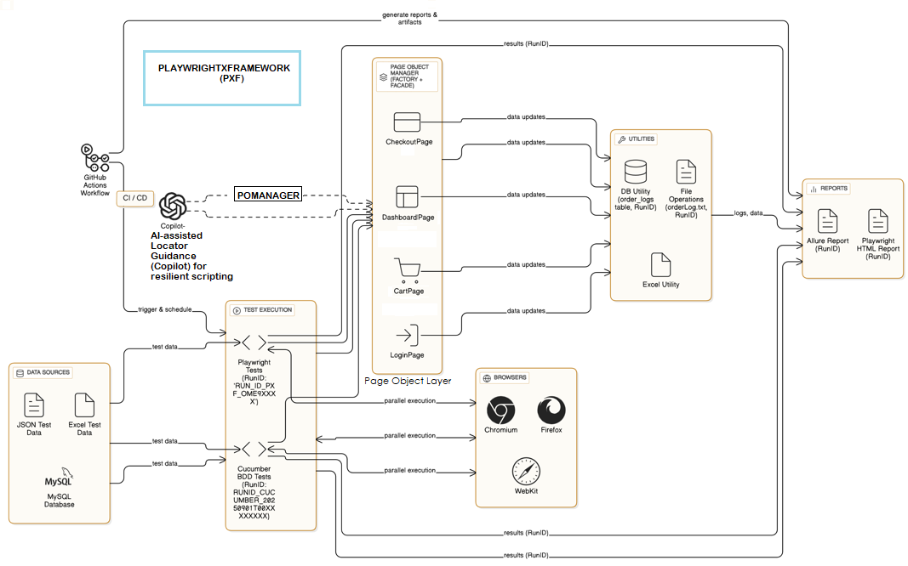


This diagram provides a **comprehensive overview of the PlaywrightXFramework (PXF)**, highlighting its **modular, maintainable, and enterprise-ready design**. It shows the interaction between the **CI/CD pipeline, test execution layer, browsers, Page Object Manager (POManager), Page Objects, utilities, AI-assisted locators, test data sources, and reporting layers**.  

PXF is designed for:  
- **Multi-browser parallel execution** (Chromium, Firefox, WebKit)  
- **Cucumber BDD support** with Gherkin feature files  
- **Database, JSON, and Excel-driven test data**  
- **AI-assisted locator guidance** via Microsoft Copilot  
- **Comprehensive reporting** with Allure and Playwright HTML reports  
- **RunID-based traceability** across tests, logs, and reports  


## Demo Video

<!-- MP4 video player -->
<video width="600" controls>
  <source src="./images/RunVideo.mp4" type="video/mp4">
  Your browser does not support the video tag.
</video>

<!-- Optional: fallback link to download the video -->
[Download the video](./images/RunVideo.mp4)


**FRAMEWORK OVERVIEW SNAPSHOT**
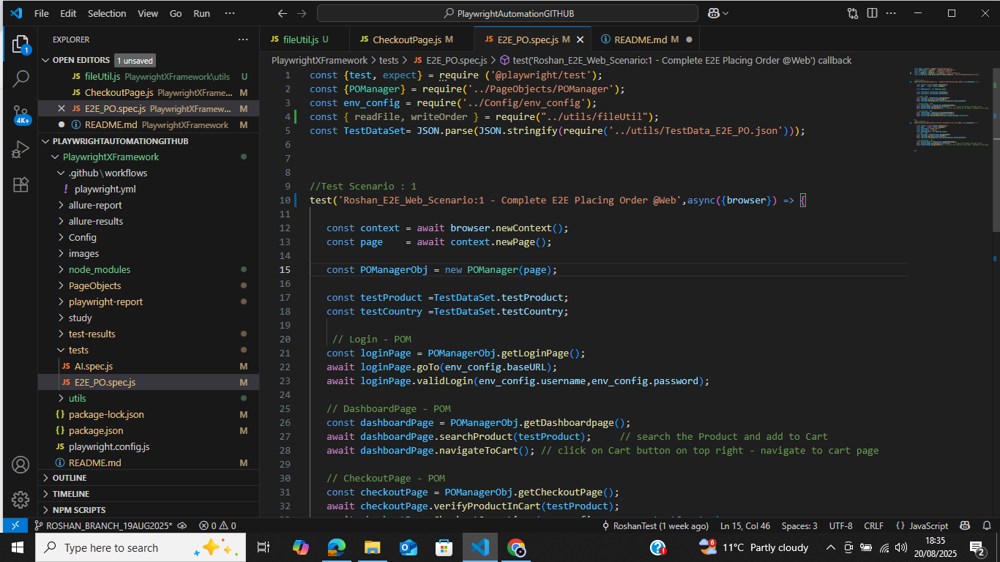

**TERMINAL OUTPUT SNAPSHOT**
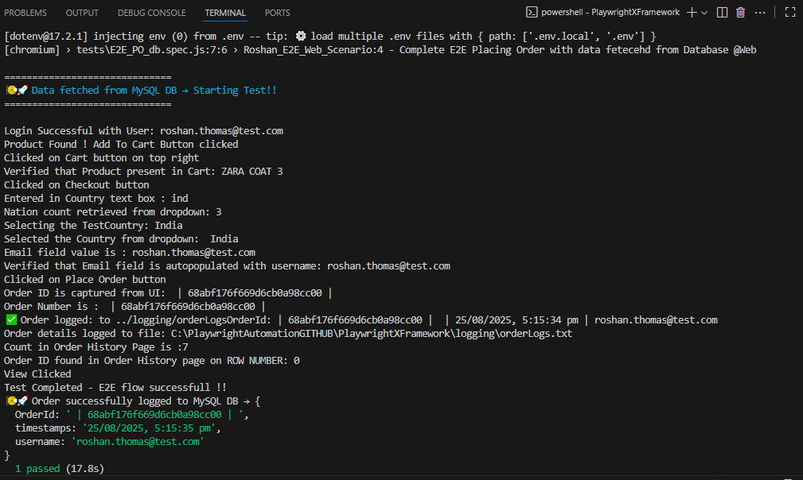

**TEST EVIDENCE SNAPSHOTS**
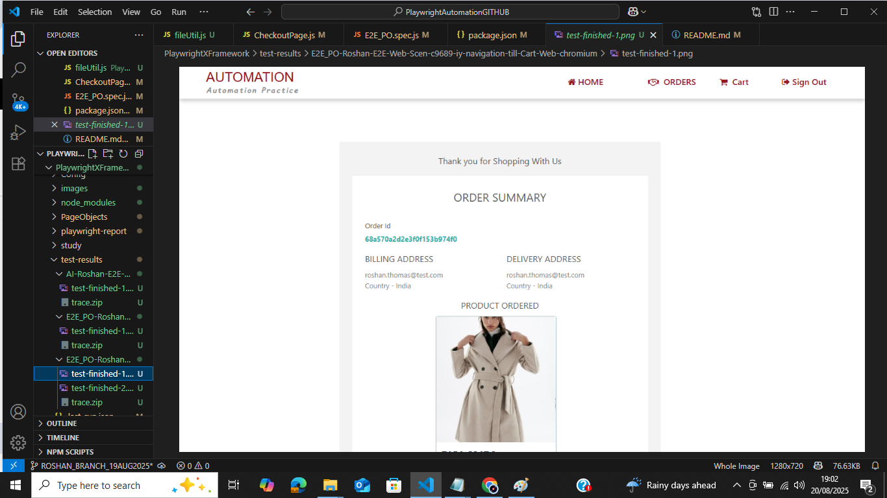


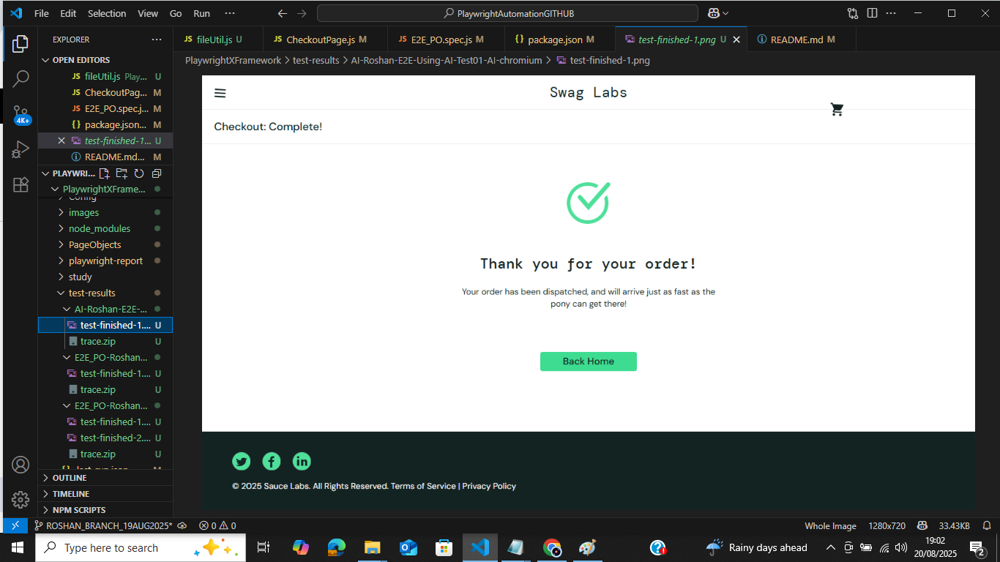


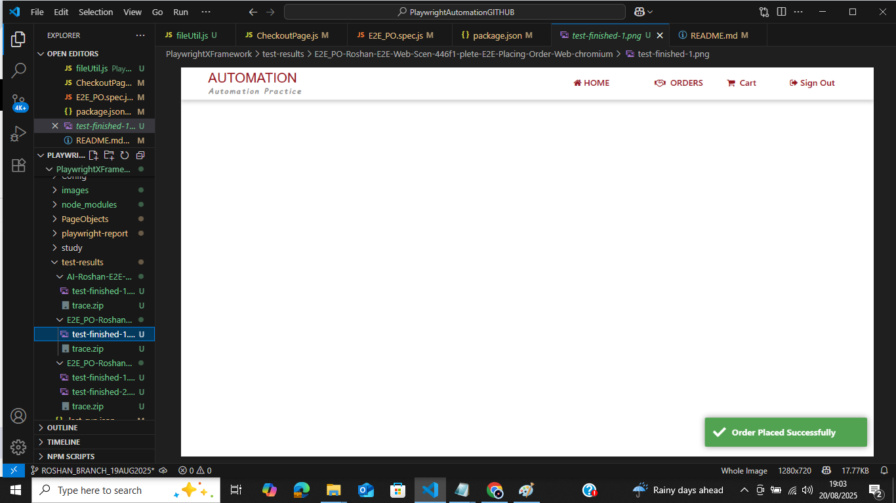

**PLAYWRIGHT HTML TEST REPORT**


**PIPELINE DASHBOARD SNAPSHOT**
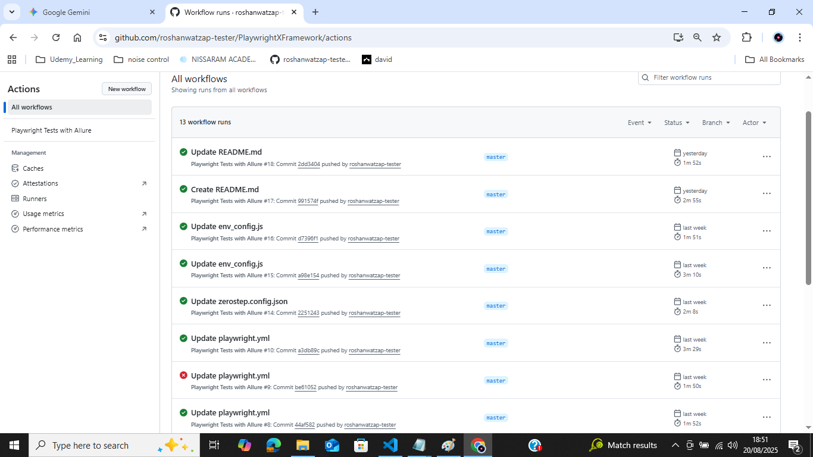

**PIPELINE TRIGGER SUCCESS AND ALLURE REPORT GENERATION SNAPSHOT**
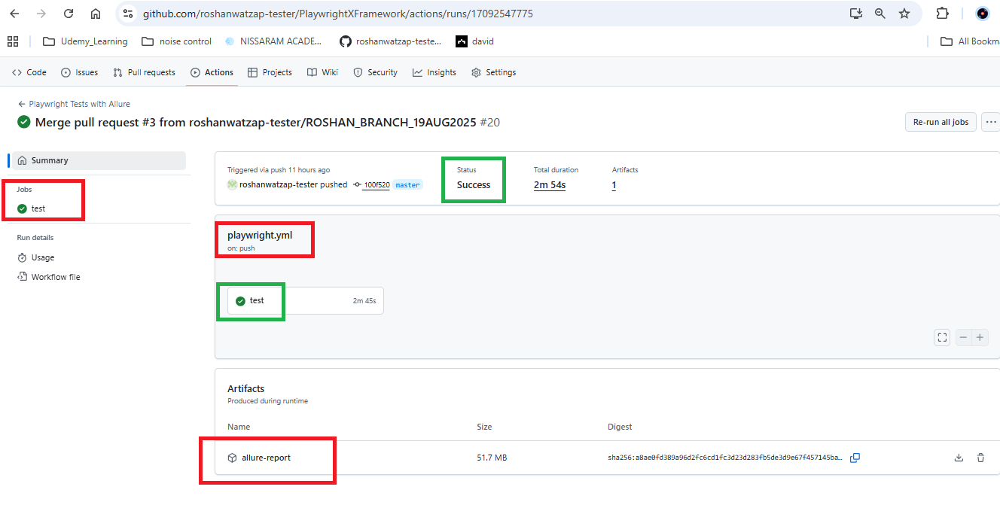

**ALLURE REPORTS SNAPSHOT**
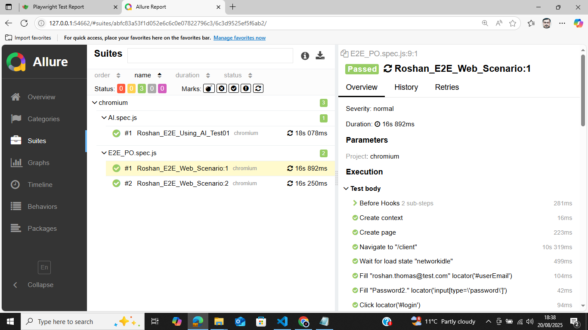

**TRACES SNAPSHOT**
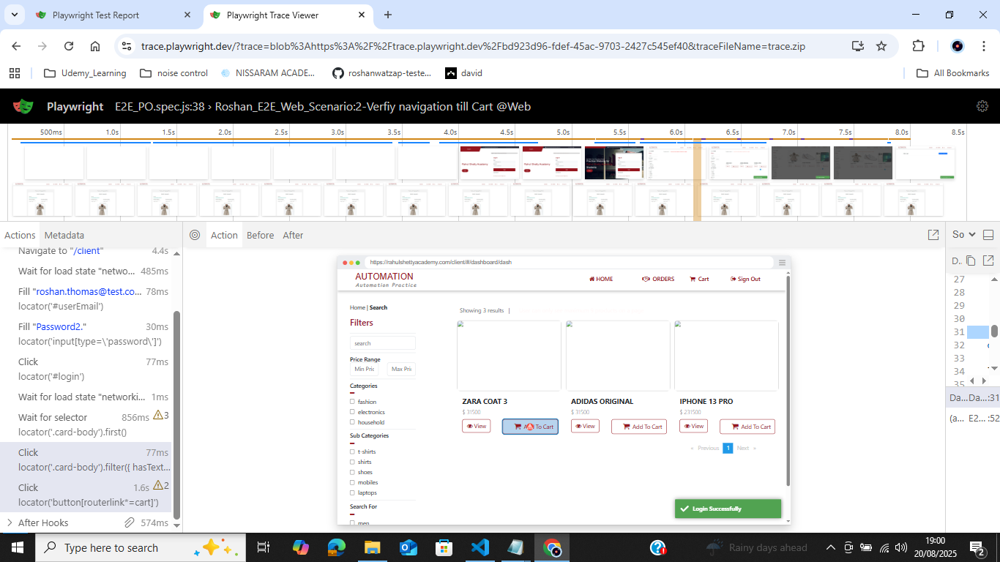

**FILE UTILITY / OPERATIONS**
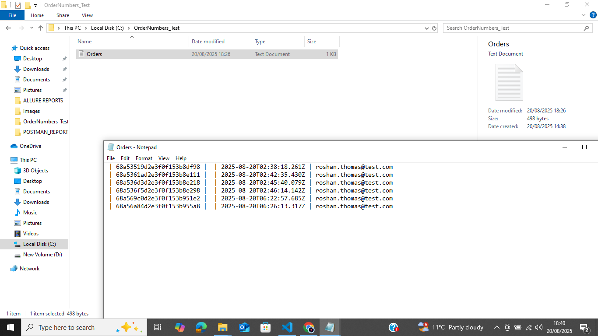

**PIPELINE SETUP SNAPSHOT**
.png)

**SCRIPTS SETUP AT PACKAGE.JSON SNAPSHOT**
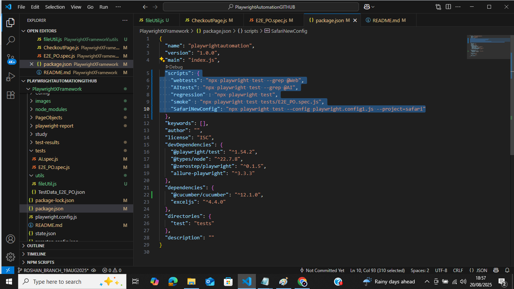

**EXCEL UTILITY SNAPSHOT**
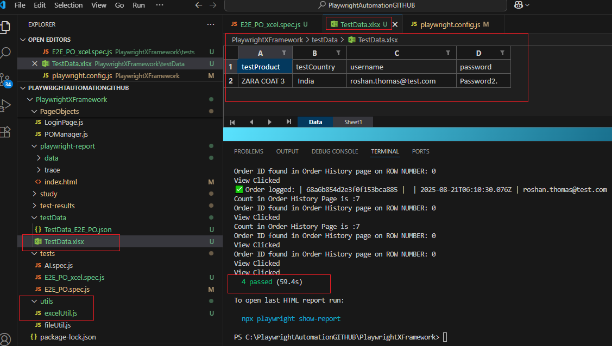


**Generating Allure Reports from CI/CD Artifacts **
Allure reports can be generated using the test execution artifacts uploaded by GitHub Actions. The PFX_AllureReports folder contains the raw allure-results data and the previously generated allure-report. By using the Allure CLI, you can generate a consolidated HTML report locally or on any environment. The reports include detailed step-level execution, screenshots, videos, traces, environment context, tester/executor info from executor.json, and the globally unique Run ID for full traceability across parallel runs and multiple browsers.

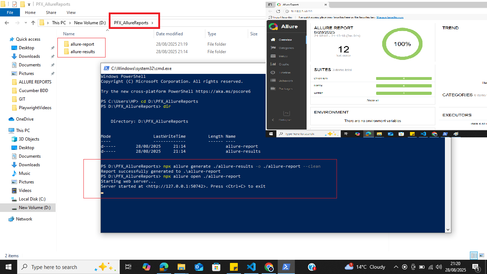

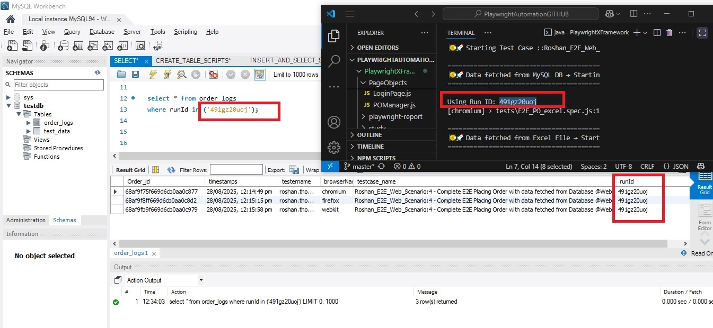
Enhancements (Added on 28/08/2025)

| Section                                | Details                                                                                                                                                                                                                                                                                                                                                                     |
| -------------------------------------- | --------------------------------------------------------------------------------------------------------------------------------------------------------------------------------------------------------------------------------------------------------------------------------------------------------------------------------------------------------------------------- |
| **Run ID Generation**                  | Globally unique Run IDs for each test execution, ensuring **traceability across parallel workers, multiple browsers, and CI/CD runs**. Run ID is linked to **Allure reports, database logs, and local `orderLog.txt`**.                                                                                                                                                     |
| **Logging & Test Utilities**           | - **Local Logging (`orderLog.txt`)**: Captures execution details for JSON and Excel utilities. <br> - **Database Logging (`Order_logs`)**: Stores test case, tester ID, browser name, timestamp, and Run ID. Ensures **cross-browser and parallel execution traceability**.                                                                                                 |
| **Environment & Config Management**    | - `.env` stores sensitive/local info (credentials, DB connection). <br> - JSON config files per environment (`test`, `staging`, `prod`). <br> - Runtime selection: `const config = require('./config/${env}.json')`. <br> - Ensures **dynamic, maintainable, and centralized environment management**.                                                                      |
| **Allure Reporting Enhancements**      | - Integrated with **helper files** (`executor.json`, environment config scripts) to populate **tester/executor info and environment details** in reports. <br> - Generates **step-level details, screenshots, videos, traces, environment info, and Run ID**. <br> - Fully compatible with CI/CD artifacts.                                                                 |
| **CI/CD Workflow Artifacts**           | - Uploaded artifacts include: <br>   • **MySQL dump** for database snapshot verification <br>   • **OrderLogs CSV** exported from `Order_logs` table <br>   • **PFX\_AllureReports folder** containing `allure-results` (raw data) and `allure-report` (generated consolidated report) <br> - Enables **consolidated Allure report generation** for interactive dashboards. |
| **Helper Files**                       | - **Executor.json:** Populates Allure reports with tester/executor details (username, ID). <br> - **Environment Variables config files:** Provide environment context (`test`, `staging`, `prod`) to Allure. <br> - **Custom helper scripts:** Read `.env` and JSON configs to dynamically inject environment and executor info into reports.                               |
| **Parallel & Cross-Browser Execution** | - Supports **Chromium, Firefox, WebKit (Safari)** with parallel execution. <br> - Run ID ensures **consistent logging, DB insertion, and reporting across all workers and browsers**.                                                                                                                                                                                       |
| **Order Logging Integration**          | - JSON and Excel utilities write logs to `orderLog.txt`. <br> - DB Utility inserts test execution details into `Order_logs` table, including **tester ID, browser, and Run ID**.                                                                                                                                                                                            |
| **Reporting & Traceability**           | - **Playwright HTML reporter** captures screenshots, videos, traces. <br> - **Allure reports** link execution to Run ID, environment, and tester info. <br> - CI/CD artifacts maintain **full traceability across parallel runs and browser types**.                                                                                                                        |
| **Flexible Test Data Management**      | - Multi-source: JSON, Excel, MySQL. <br> - Centralized design allows **dynamic environment switching and reusable test data**.                                                                                                                                                                                                                                              |
| **Enhanced CI/CD Integration**         | - GitHub Actions workflow ensures **continuous validation** on every push or PR. <br> - Artifacts and reports are linked with **Run ID, environment, and executor info** for full visibility.                                                                                                                                                                               |

## Used Microsoft Co Pilot for generating AI assisted Self-healing locators. 

### Login Page
- Implemented **AI-style self-healing locators** using **GitHub Copilot**.
- Multiple fallback locators for `username`, `password`, `sign-in button`, and `error messages` to make tests more resilient to UI changes.
- Verification method for **unsuccessful login** (invalid credentials), including dynamic waits for transient error messages.
- The code for this Login Page was **generated and assisted by Microsoft Copilot**, which helped:
  - Generate the Page Object file structure following best practices.
  - Add methods for entering username, password, clicking login, and verifying login outcomes.
  - Suggest multiple locator strategies for each element (fallbacks/self-healing style).
  - Scaffold reusable patterns across the codebase for maintainability and readability.
- **Note:** This self-healing implementation and Copilot-assisted generation is currently applied to **Login Page only**.

 ## **About the** **CUCUMBER FRAMEWORK IMPLEMENTATION**

| **Section**                          | **Description**                                                                                                                                                                                                                                  | **Location / Commands**                                                                                                           |
| ------------------------------------ | ------------------------------------------------------------------------------------------------------------------------------------------------------------------------------------------------------------------------------------------------ | --------------------------------------------------------------------------------------------------------------------------------- |
| **Feature Files**                    | Describe test scenarios in Gherkin syntax (BDD style). Each `.feature` file contains scenarios and steps.                                                                                                                                        | `Cucumber/features/`                                                                                                              |
| **Step Definitions**                 | Implements the logic for each step in feature files. Step definitions interact with the application, database, and test data.                                                                                                                    | `Cucumber/steps/` <br> Example: `orderSteps.js`                                                                                   |
| **Hooks**                            | Hooks (`Before`, `After`) are used for setup, teardown, and **generating unique RUNID** for each test execution. They also handle DB logging and test context initialization.                                                                    | `Cucumber/steps/hooks.js`                                                                                                         |
| **Database Integration**             | - **Read Test Data**: Fetch dynamic test data like login credentials or order details from DB.<br> - **Log Test Results**: Write scenario execution status, logs, and RUNID back to DB for tracking.                                             | Configured via DB utility module (e.g., `db.js`)                                                                                  |
| **Run Tests & Generate JSON Report** | Executes all feature files and stores results as JSON, tagged with RUNID from hooks.                                                                                                                                                             | `bash npx cucumber-js features --require steps/hooks.js --require steps/orderSteps.js --format json:reports/cucumber-report.json` |
| **Generate HTML Report**             | Converts the JSON report into a readable HTML report for analysis.                                                                                                                                                                               | `bash node reports/generate-Cucumber-report.js`                                                                                   |
| **Notes**                            | - Place all feature files in `features/`.<br> - Place all step definition files and hooks in `steps/`.<br> - Reports are saved in `reports/` folder.<br> - RUNID from hooks ensures traceability.<br> - Suitable for CI/CD pipeline integration. | N/A                                                                                                                               |
## Screenshots CUCUMBER FRAMEWORK IMPLEMENTATION


### Cucumber Run DB Log
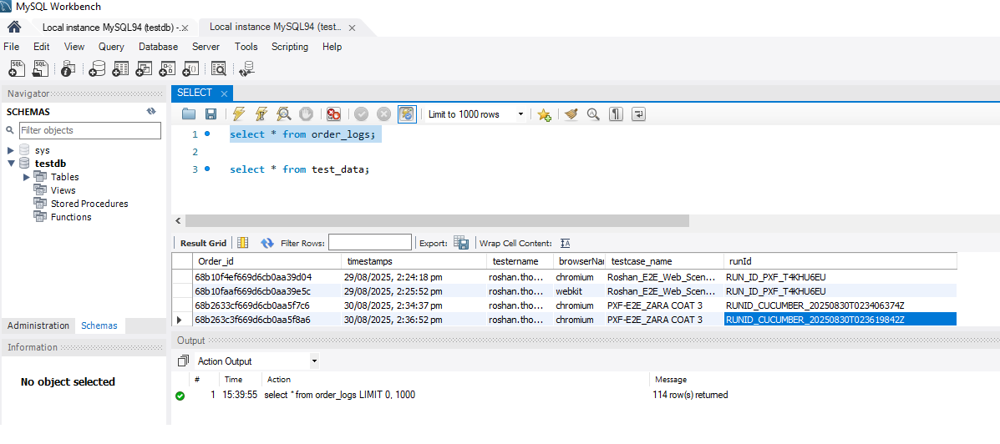

### Cucumber HTML Report
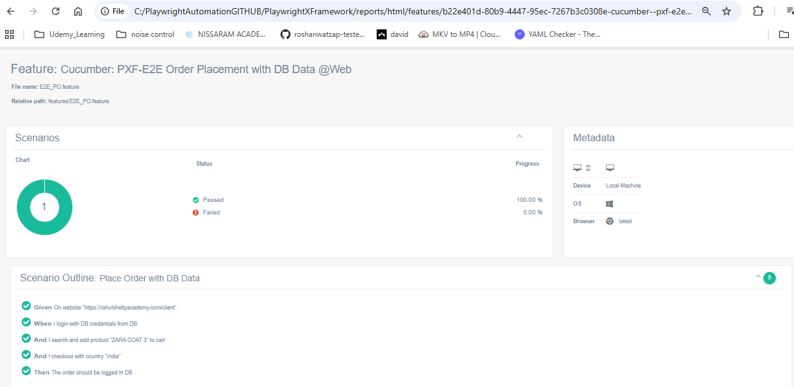


  ### Copilot Suggestion Accepted
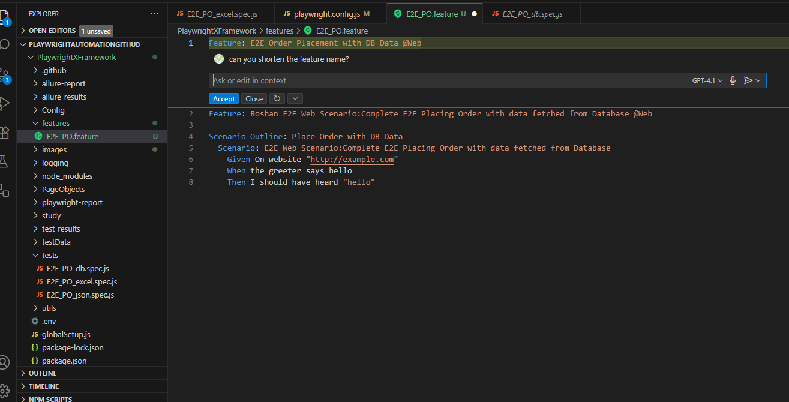
