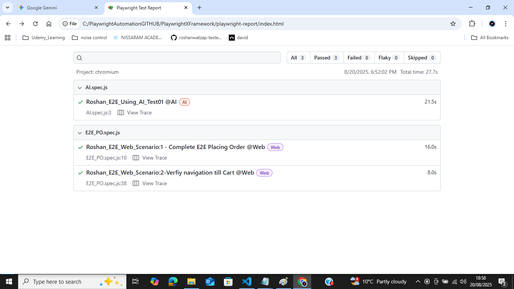

| Section                    | Details                                                                                                                                                                                                                                                                                                                                                                                                                                                                                                          |
| -------------------------- | ---------------------------------------------------------------------------------------------------------------------------------------------------------------------------------------------------------------------------------------------------------------------------------------------------------------------------------------------------------------------------------------------------------------------------------------------------------------------------------------------------------------- |
| **Author**                 | **Roshan Thomas - Auckland, New Zealand**   GitHub: [roshanwatzap-tester](https://github.com/roshanwatzap-tester)                                                                                                                                                                                                                                                                                                                                                                                                                     |
| **Overview**               | **PlaywrightXFramework** is a robust, modular, maintainable end-to-end UI automation framework built in **JavaScript**.   - Async handling and modularity   - Page Object Manager (POManager) using Factory + Facade patterns   - JSON-driven test data   - CI/CD via GitHub Actions   - Comprehensive reporting (Allure + Playwright HTML)   - Supports Chromium, Firefox, WebKit with parallel execution   - Clear separation of concerns   - Study folder for JavaScript fundamentals |
| **Framework Architecture** | **POManager (Page Object Manager)** implements **Factory + Facade design patterns**:   - **Factory:** Instantiates page objects (`LoginPage`, `DashboardPage`, `CheckoutPage`) dynamically   - **Facade:** Provides unified API for multiple page objects   - Single-point access via `poManager.getLoginPage()`   - Separates test scripts from UI locators and actions                                                                                                                             |
| **Example Usage**          | `javascript   const poManager = new POManager(page);   await poManager.getLoginPage().validLogin(username, password);   await poManager.getDashboardPage().selectProduct("ZARA COAT 3");   await poManager.getCheckoutPage().completeCheckout();   `                                                                                                                                                                                                                                              |
| **Page Objects**           | Encapsulate locators and actions per page.   - Example: LoginPage handles username, password fields, login button   - Uses Playwright auto-waits and network idle checks for stability                                                                                                                                                                                                                                                                                                                     |
| **Test Data Management**   | - JSON files store environment configurations and scenario data   - Switch easily: `const env = 'test'`   - Centralized for portability, maintainability, reusability   - Example `testData.json`:   `json   { "testProduct": "ZARA COAT 3", "testCountry": "India", "username": "roshan.thomas@test.com", "password": "Password2." }   `                                                                                                                                                      |
| **Built with JavaScript**  | - Seamless Playwright integration   - Async/await handling   - Modular and fast execution   - **Study Folder**:   ArrayBasics.js, BubbleSortArray.js, Palindrome.js, Promise.spec.js, SessionStorage.spec.js   - Demonstrates loops, functions, async behavior, data structures, algorithmic thinking   💡 Mastering fundamentals improves framework design and problem-solving                                                                                                                |
| **Reporting**              | **Playwright HTML Reporter**:   - Captures screenshots, videos, traces   - Quick debugging and failure analysis   **Allure Reporting**:   - CI/CD integration   - Rich dashboards with trends, history, step-wise details   **Commands**:   `npx playwright test --reporter=line,allure-playwright`   `npx allure generate ./allure-results -o ./allure-report`   `allure open ./allure-report`                                                                                       |
| **CI/CD Integration**      | - GitHub Actions workflow in `.github/workflows/playwright.yml`   - Triggers: push or PR to master   - Steps: Checkout → Setup Node.js → Install dependencies → Install Playwright browsers → Run tests → Generate & upload Allure reports   - Ensures continuous validation on every commit                                                                                                                                                                                                            |
| **Browser Compatibility**  | - Chromium ✅   - Firefox   - WebKit (Safari)   - Configured in `playwright.config.js` with parallel execution                                                                                                                                                                                                                                                                                                                                                                     |
| **Project Structure**      | `/tests` – Test scenarios   `/pages` – Page Objects   `/components` – Reusable UI components   `/helpers` – Utility modules   `/workflows` – Business workflows   `/config` – JSON environment configs   `/study/basics` – JS exercises   `/reports` – HTML & Allure reports   `/.github/workflows` – CI/CD YAML files                                                                                                                                                                   |
| **Git Workflow**           | **Initial Setup:**   `bash   git init   git add .   git commit -m "Initial commit"   git remote add origin https://github.com/roshanwatzap-tester/PlaywrightXFramework.git   git push -u origin master   `   **Daily Workflow:**   `bash   git clone <repo-url>   git checkout -b ROSHAN_BRANCH   git add .   git commit -m "Changes in Env Config"   git push -u origin ROSHAN_BRANCH   git branch -d ROSHAN_BRANCH   `                                         |
| **Getting Started**        | `bash   git clone https://github.com/roshanwatzap-tester/PlaywrightXFramework.git   npm install   cp .env.example .env   npx playwright test   npx allure generate ./allure-results -o ./allure-report   allure open ./allure-report   `                                                                                                                                                                                                                                                    |
| **Key Benefits**           | - **Separation of Concerns:** Test logic decoupled from locators   - **Reusability:** Factory + Facade patterns   - **Scalability:** Add new pages/components/workflows easily   - **Reliability:** Auto-waits, reports, traces, retries   - **CI/CD Ready:** GitHub Actions   - **Flexible Test Data:** JSON-driven   - **Enterprise-Ready:** Professional structure, rich reporting, deep programming proficiency                                                                            |
| License         | Description                                                                                                   | Key Points       
| **MIT License** | A permissive open-source license allowing free use, modification, distribution, and sublicensing of software. | - Must include original copyright notice   - No warranty, authors not liable   - Can be used commercially or personally |
**Playwright Configuration (playwright.config.js) Explained**
| Configuration Key  | Current Value                                             | Description                                                                         | Setup / Change Examples                                                                                     |
| ------------------ | --------------------------------------------------------- | ----------------------------------------------------------------------------------- | ----------------------------------------------------------------------------------------------------------- |
| **testDir**        | `'./tests'`                                               | Directory where all test files reside.                                              | Default is `./tests`. Can be changed to `./e2e-tests` or any folder where your test scripts live.           |
| **timeout**        | `80 * 1000` (80 seconds)                                  | Maximum time allowed for a single test before failing.                              | Increase for slow tests: `120 * 1000` (120s).                                                               |
| **fullyParallel**  | `true`                                                    | Allows tests in different files to run in parallel.                                 | Set to `false` if tests must run sequentially due to shared state or resources.                             |
| **forbidOnly**     | `!!process.env.CI`                                        | Fails the build if a `test.only` is left in the code during CI runs.                | Usually `true` in CI. Can be disabled locally: `false`.                                                     |
| **retries**        | `process.env.CI ? 0 : 0`                                  | Number of retry attempts for failed tests.                                          | Example: `retries: 2` retries failed tests twice. Often higher in CI for flakiness.                         |
| **workers**        | `process.env.CI ? 1 : undefined`                          | Number of parallel worker processes.                                                | Can set manually: `workers: 4`. Using `1` in CI ensures sequential execution.                               |
| **reporter**       | `'html'`                                                  | Test reporter type. Options: `html`, `list`, `dot`, `allure-playwright`, etc.       | Example: `reporter: [['allure-playwright']]` for Allure reports.                                            |
| **use.headless**   | `false`                                                   | Whether the browser runs in headless mode.                                          | `true` for CI; `false` for local debugging to see browser actions.                                          |
| **use.timeout**    | `30000` (30 seconds)                                      | Maximum time for actions like click, type, waitForSelector.                         | Increase if some UI actions take longer: `60000`.                                                           |
| **use.screenshot** | `'on'`                                                    | Capture screenshots automatically. Options: `'on'`, `'off'`, `'only-on-failure'`.   | `'only-on-failure'` reduces storage use.                                                                    |
| **use.trace**      | `'on'`                                                    | Captures trace of browser actions. Options: `'on'`, `'retain-on-failure'`, `'off'`. | `'retain-on-failure'` is recommended for CI.                                                                |
| **use.viewport**   | `null`                                                    | Browser viewport size. `null` uses full screen.                                     | Can set `viewport: { width: 1280, height: 720 }` for fixed resolution testing.                              |
| **use.video**      | `'on'`                                                    | Records video of test runs. Options: `'on'`, `'off'`, `'retain-on-failure'`.        | `'retain-on-failure'` recommended to save space.                                                            |
| **projects**       | `{name: 'chromium', use: {...devices['Desktop Chrome']}}` | Defines browser(s) for running tests.                                               | Can add `firefox`, `webkit`:   `js   { name: 'firefox', use: {...devices['Desktop Firefox']} }   ` |
| **devices**        | `devices['Desktop Chrome']`                               | Predefined device/browser configuration from Playwright.                            | Can use mobile devices:   `devices['Pixel 5']` for mobile emulation.                                     |
|
Setup Notes
+++++++++++
Defaults are safe for local development.
Uncomment multiple projects to run tests on multiple browsers.
Adjust screenshots, trace, and video for storage efficiency in large suites.

Creating Custom scripts to trigger the tests from package.json
++++++++++++++++++++++++++++++++++++++++++++++++++++++++++++++
To run few selected tests in local (Like Smoke/Sanity/Regression)>
or you want to run for a particular config alone in Safari etc.
Example: 
npm run webtests  will trigger the below command::
> npx playwright test --grep @Web

Pacakge.Json set as below:

scripts": {
     "webtests" : "npx playwright test --grep @Web",
     "AItests"  : "npx playwright test --grep @AI",
     "SafariNewConfig" : "npx playwright test --config playwright.config1.js --project=safari"
  }

.png)

  
